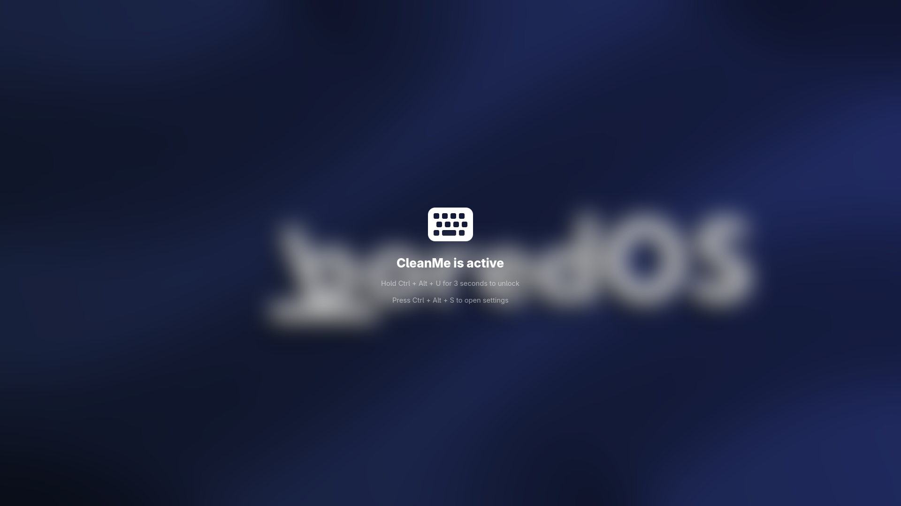

# CleanMe

  
<h3>Minimal modern Python app to temporarily lock your keyboard and mouse for cleaning. Unlock with a secure key combination. (Linux Only)</h3>

---

> [!NOTE]
> Note that app is missing an icon. I am working on it. Once done ill upload the app to Flathub.

## Features
- Locks all keyboard and mouse input.
- Minimal fullscreen GUI.
- Unlock by holding **Ctrl + Alt + U** for 3 seconds (in any order).
- Prevents accidental unlocks.
- Custom background image
- Background blur effect

## Why?
- Clean your keyboard and mouse without accidental input.
- Lock input for focus or security.
