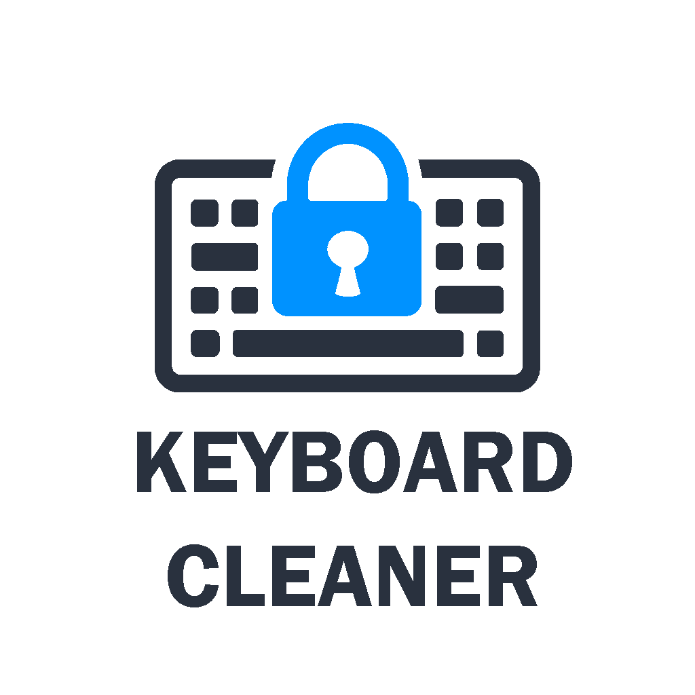
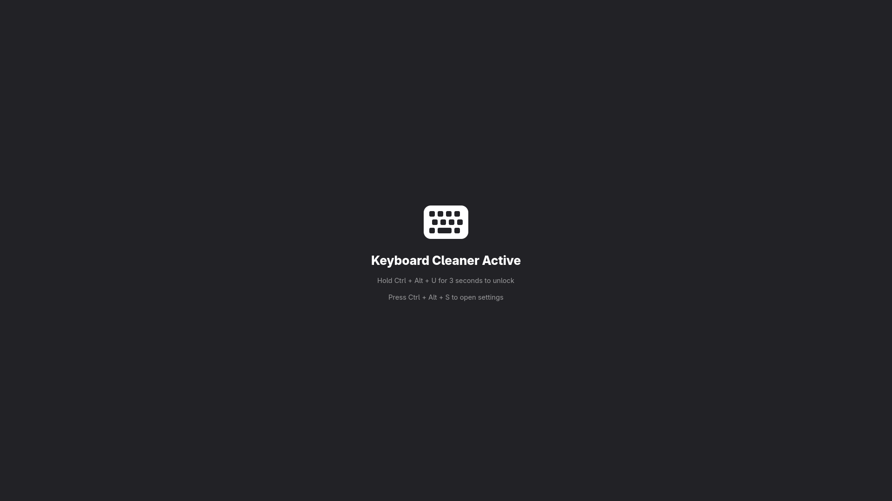

<div align="center">
  

# Keyboard Cleaner

### Modern GNOME application to temporarily lock your keyboard and mouse while cleaning them.

Unlock safely using a configurable key combination and avoid accidental input while maintaining a clean and simple user experience.


[](https://opensource.org/licenses/MIT)

</div>

---




> [!IMPORTANT]
> This is the Linux version. Windows version can be found [here](https://github.com/naplon74/keyboard-cleaner).

## Features

- Lock keyboard and mouse input while cleaning.
- Fullscreen distraction-free interface.
- Secure unlock shortcut (**Ctrl + Alt + U** held for 3 seconds).
- Prevents accidental unlocks.
- Custom background image support.
- Optional background blur effect.
- Debug mode for development and testing.
- Simple settings dialog.
- Native GNOME / Libadwaita interface.

>[!NOTE]
> The app is meant to run on GNOME, Alt + Tab is not blocked nor are gesture. 

---

## Why?
- Clean your keyboard and mouse without accidental input.
- Lock input for focus or security.

---

## Usage

1. Launch Keyboard Cleaner.
2. Clean your keyboard and mouse safely.
3. Hold **Ctrl + Alt + U** for 3 seconds to unlock.
4. Press **Ctrl + Alt + S** to open the settings dialog.

---

## Settings

Keyboard Cleaner supports:

- Custom background images
- Optional blur effect
- Debug mode (Allows Alt + F4)

Settings are stored locally and remain private to the user.

---

## Privacy

Keyboard Cleaner:

- Does **not** collect any personal data.
- Does **not** send any information over the network.
- Does **not** log keystrokes.
- Does **not** track user activity.

All processing happens locally on your machine.

---

## Building

### Requirements

- Python 3
- GTK 4
- Libadwaita
- Meson
- Flatpak SDK (recommended)

### Build

```bash
meson setup build
meson compile -C build
meson install -C build
````

---

## License

This project is licensed under the MIT License.

See the [LICENSE](LICENSE) file for details.
